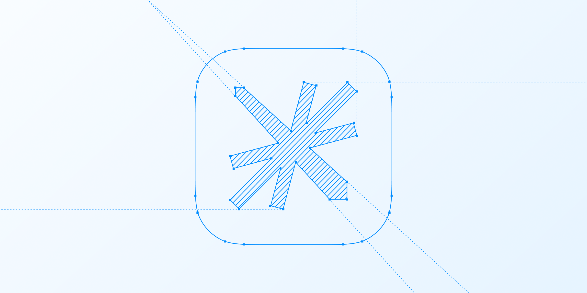

# 마크다운 파일

## 들어가기 전

ㅋㅋ

1. 넘버링 테스트
2. 넘버링 테스트
3. 넘버링 테스트

- 닷 테스트
- 닷 테스트

```js
// 코드 작성 테스트
console.log("hello world!");
```

```js
const run = async () => {
  const posts = await getPosts();
  fs.mkdirSync(path.dirname(OUTPUT), { recursive: true });
  fs.writeFileSync(OUTPUT, JSON.stringify(posts, null, 2));
  console.log("✅ posts.json generated:", OUTPUT);
};

run();
```

- [ ] 가나다
- [ ] 가나다



